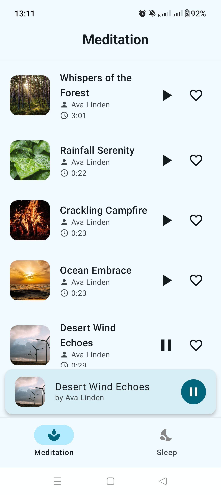
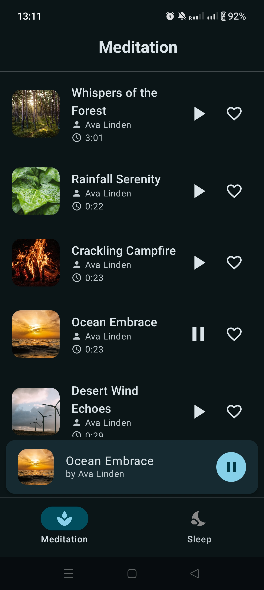

# 🌿 Calmly – Minimalist Meditation + Sleep Sounds App

A clean and soothing Android app designed for meditation and sleep. Built with modern Android development practices, Calmly allows users to play looped ambient sounds via a sleek and clutter-free interface.






## 📽 Demo Video

Watch the demo video here: [🎥 Calmly App Demo](https://drive.google.com/file/d/1Cumos80yPmohU5dekpUfUCX1q791wFt9/view?usp=sharing)

## 📱 APK for Testing

Download APK: [📦 Calmly_v1.0.apk](https://drive.google.com/file/d/1B8ncM6gn4JW_dGyEsTF8z7kB0r8oKOld/view?usp=drive_link)

---

## 🌟 Features

### 🧘 Meditation Tab
- 4–5 ambient sound categories (e.g., Forest, Rain, Campfire, Ocean).
- High-quality looped playback.
- Play/Pause with a single tap.

### 🌙 Sleep Tab
- 4–5 calming sound categories (e.g., White noise, Lullaby, Fan, Deep hum).
- Each sound loops seamlessly.
- Only one sound plays at a time (auto-stop others).

### 🔊 Foreground Media Service + Notification
- Foreground MediaService handles playback and keeps it running in the background.
- Persistent notification with Play/Pause and Stop controls.
- Seamless media control even when the app is minimized.

### 🎨 Clean UI/UX
- Inspired by Calm, Tide, and Headspace.
- Minimal, clutter-free layout with soft pastel color palettes.
- Sound cards with image thumbnails, titles, and controls.

---

## 🧱 Architecture

The app follows **MVVM Architecture** and uses:
- Jetpack Compose for modern UI
- Media3 (ExoPlayer) for seamless sound looping
- ViewModel & LiveData for UI state management
- Koin for Dependency Injection
- Clean Architecture principles: Data, Domain, and Presentation layers

---

## 🗂 Tech Stack

| Category         | Tools/Frameworks                         |
|------------------|------------------------------------------|
| Language         | Kotlin                                   |
| UI Toolkit       | Jetpack Compose                          |
| Media            | ExoPlayer (Media3), MediaSession         |
| Architecture     | MVVM, Clean Architecture                 |
| Dependency DI    | Koin                                     |
| Android Features | Foreground Service, Notifications        |
| Build Tool       | Gradle                                   |
| Min SDK          | 24 (Android 7.0)                         |

---

## 📦 Assets

- All sound files are lightweight (<5MB) and royalty-free.  
- Sourced from Pixabay.

---

# 🚀 Bonus Features

⚠️ Optional additions planned but **not yet implemented**:
- 🕒 Sleep Timer: Set auto-stop for 15/30/60 minutes.
- 💾 Last Played Sound: Automatically resumes on app restart.

These features will be added in future commits.


---

## 📌 How to Run

1. Clone the repo:
   ```bash
   git clone https://github.com/yourusername/calmly.git
   ```
2. Open in Android Studio (Giraffe or newer recommended).
3. Allow permissions and run on emulator or physical device.
4. Optionally install the APK from the link above.

---

## 📧 Contact

For queries or feedback, reach out at: [shahvivek138@gmail.com](mailto:shahvivek138@gmail.com)  
Connect with me on LinkedIn: [LinkedIn](https://www.linkedin.com/in/vivek-shah-36883a235/)


---

## 📜 License

This project is for educational and demo purposes only. All audio assets used are free and attributed to their original creators.